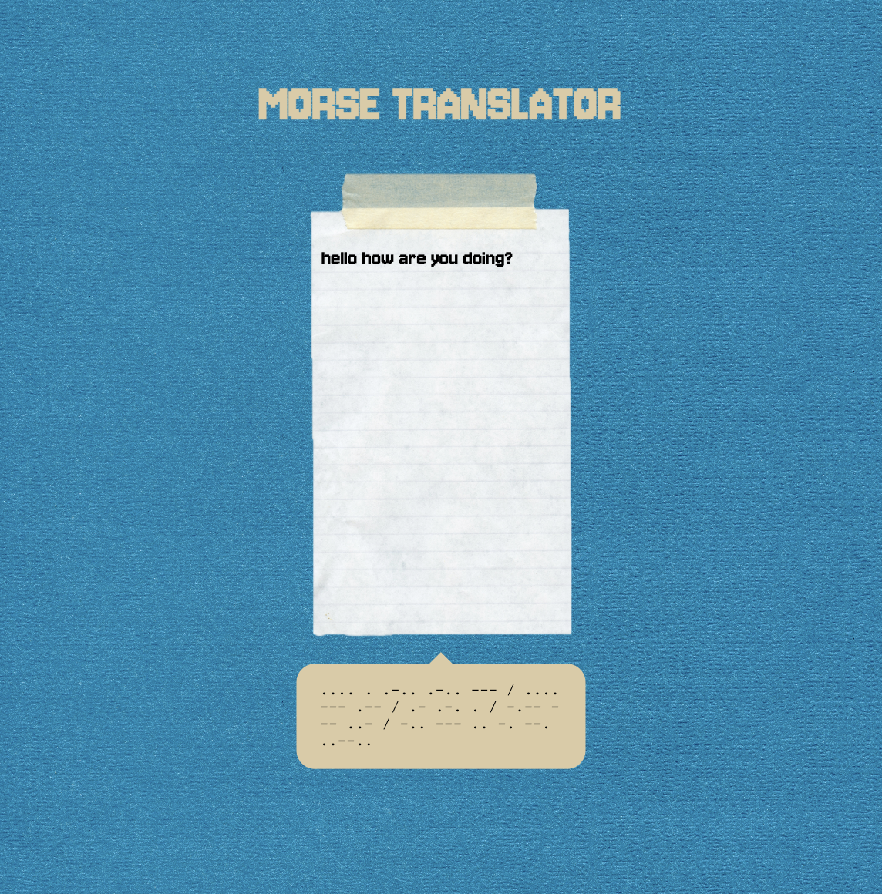

# Morse Translator

A Morse code translator built with React. Type in English or Morse code — the app detects which one and translates automatically.



## Features

- Auto-detects input: English gets translated to Morse, Morse gets translated to English
- Hover over the title to see it in Morse code
- Input limited to 80 characters so the notebook layout stays clean
- Tests with Jest

## Tech

- React (Vite)
- SCSS (BEM naming)
- Jest + Babel for testing

## Getting started

```bash
npm install
npm run dev
```

## Tests

```bash
npm run test
```

## How it works

| input | detected as | output |
|---|---|---|
| `hello` | English | `.... . .-.. .-.. ---` |
| `.... . .-.. .-.. ---` | Morse | `hello` |
| `hello world` | English | `.... . .-.. .-.. --- / .-- --- .-. .-.. -..` |

Detection is based on whether the input contains `.` or `-`. If yes, it's treated as Morse code.
